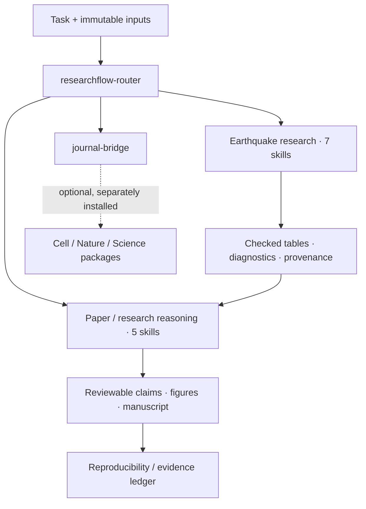

# ResearchFlow-Skills

**从地震数据到可审查论文：面向 Codex 的科研 Agent Skills。**

Earthquake research · Evidence reasoning · Optional journal integration

V1.0.0 includes **14 original skills** with standard `SKILL.md`, UI metadata, installation scripts, synthetic examples, validation and a static documentation site. These skills guide a capable agent through real analysis; they do not ship validated GMMs, a REML solver or earthquake prediction services. This project has no affiliation with OpenAI or journal publishers.

## Start in three steps

1. Clone or download this repository; open its directory in a terminal.
2. Install user skills with one of the commands below. Python 3.10+ is required for installation; PowerShell 5.1+ or Bash is required for the wrapper. The installer never overwrites an existing skill directory, even if identical. Review collisions rather than silently upgrading.
3. Ask Codex to use `$researchflow-router`, or mention a specific skill. If new skills do not appear, restart Codex.

```powershell
# Windows — from the repository root
.\scripts\install.ps1 -Scope user -DryRun
.\scripts\install.ps1 -Scope user
# For one project, pass its actual root
.\scripts\install.ps1 -Scope project -ProjectRoot C:\Research\my-project
```

```bash
# macOS / Linux — from the repository root
bash scripts/install.sh --scope user --dry-run
bash scripts/install.sh --scope user
bash scripts/install.sh --scope project --project-root /path/to/my-project
```

Default destinations are `~/.agents/skills` and `<project>/.agents/skills`, matching [current official Codex skill documentation](https://developers.openai.com/codex/skills/), checked 2026-09-30. For a host configured to use another location, pass `-Destination` / `--destination`; legacy `.codex/skills` compatibility depends on that host and is not promised. A clone alone does not install skills.

## Architecture



Router plans dependencies and proposes independent branches. Actual parallel execution depends on available agent tools and authorization; sequential execution is supported. Journal requirements cannot repair missing evidence.

## Skill cards

### [地震动分析 · `ground-motion-analysis`](skills/ground-motion-analysis/SKILL.md)

**Earthquake** — Analyze accelerograms, intensity measures, and response spectra with explicit units and processing provenance. Use for seismic waveform analysis, not GMM fitting.

### [GMM 残差分析 · `gmm-residual-analysis`](skills/gmm-residual-analysis/SKILL.md)

**Earthquake** — Compare observed ground motion with published GMM predictions and diagnose residual patterns. Use for model evaluation, not estimating random effects.

### [混合效应 REML · `mixed-effects-reml`](skills/mixed-effects-reml/SKILL.md)

**Earthquake** — Fit and diagnose linear mixed models using REML with crossed event and station effects. Use for variance estimation and uncertainty, not choosing fixed effects by REML likelihood.

### [震源—路径—场地分解 · `event-path-site-decomposition`](skills/event-path-site-decomposition/SKILL.md)

**Earthquake** — Decompose seismic residuals into event, path and site contributions with identifiability checks. Use when physical attribution beyond a residual fit is requested.

### [随机振动模拟 · `random-vibration-simulation`](skills/random-vibration-simulation/SKILL.md)

**Earthquake** — Simulate stochastic earthquake motion or apply random vibration theory with explicit source, path, site and duration assumptions. Use for stochastic simulations, not deterministic rupture solvers.

### [情景地震 · `scenario-earthquake`](skills/scenario-earthquake/SKILL.md)

**Earthquake** — Construct reproducible earthquake scenarios and conditional ground-motion estimates. Use for scenario planning, not probabilistic hazard or earthquake prediction.

### [地震快速研判 · `earthquake-rapid-analysis`](skills/earthquake-rapid-analysis/SKILL.md)

**Earthquake** — Prepare a source-timestamped rapid earthquake assessment from preliminary event reports and observations. Use after a reported event; do not issue predictions or unverified casualties.

### [证据链 · `evidence-chain`](skills/evidence-chain/SKILL.md)

**Reasoning** — Trace manuscript claims to inspectable observations, analyses and sources. Use for claim support audits and evidence planning.

### [图件审计 · `figure-audit`](skills/figure-audit/SKILL.md)

**Reasoning** — Audit scientific figures against source data, uncertainty and manuscript claims. Use for figure correctness and evidence presentation, not cosmetic redesign alone.

### [论文主线 · `paper-storyline`](skills/paper-storyline/SKILL.md)

**Reasoning** — Build an evidence-grounded manuscript argument and figure sequence from author-provided results. Use for research narrative structure, not journal-specific stylistic imitation.

### [审稿视角审计 · `reviewer-audit`](skills/reviewer-audit/SKILL.md)

**Reasoning** — Review scientific manuscripts for validity, contribution and actionable major/minor concerns using provided evidence. Use for mock peer review, not submission decisions or author rebuttals.

### [可复现性审计 · `reproducibility-audit`](skills/reproducibility-audit/SKILL.md)

**Reasoning** — Audit whether scientific outputs can be traced and rerun from inputs, code and environments. Use for provenance, rerun and delivery checks.

### [期刊技能桥接 · `journal-bridge`](skills/journal-bridge/SKILL.md)

**Journal** — Connect research tasks to separately installed journal skills and current author instructions. Use for Cell, Nature, Science or other journal constraints without bundling third-party text.

### [科研任务路由 · `researchflow-router`](skills/researchflow-router/SKILL.md)

**Router** — Route multi-step earthquake research and manuscript tasks to relevant ResearchFlow skills with dependency-aware parallel suggestions. Use for combined workflows, not every single-task request.

## Try it

```text
Use $researchflow-router to assess these earthquake records and manuscript figures.
First verify units, record IDs and source boundaries. Propose the minimum useful
skill set and identify independent branches. Use separate outputs and provide
row-level evidence, uncertainty and blockers. Do not manufacture missing data.
```

Browse [all prompts](examples/prompts.md), [the synthetic residual demo](examples/synthetic-residuals/README.md), [installation](docs/installation.md), [journal integration](docs/journal-integration.md), [scientific sources](docs/scientific-sources.md), [validation](docs/validation.md) and [publishing](docs/publishing.md).

## Visible documentation

`docs/index.html` is an offline-ready searchable card homepage. Build a complete navigable site with `python scripts/build_docs.py`; serve `site/` locally or use the supplied GitHub Pages workflow. README and skill pages are rendered into the site with rewritten internal links. No external JavaScript/CDN is required.

## Development

```bash
python -m pip install -r requirements-dev.txt
python scripts/validate.py
python -m unittest discover -s tests -v
python scripts/build_docs.py
```

GitHub Actions runs these checks on Windows, Ubuntu and macOS. It validates frontmatter, catalog, UI metadata, folder names, local links/anchors and repository structure; it does not prove numerical or scientific correctness. See the [V1 test scope](docs/validation.md).

## License and contribution

Original code, skill text and documentation use [MIT](LICENSE). MIT is chosen for easy reuse and contribution; contributors retain their copyright. If formal patent grants become important, consider a future Apache-2.0 licensing decision rather than silently changing existing rights. External journal packages retain their own licenses and notices; none are vendored here. Read [CONTRIBUTING](CONTRIBUTING.md), [Code of Conduct](CODE_OF_CONDUCT.md), [security reporting](SECURITY.md) and [CHANGELOG](CHANGELOG.md).
